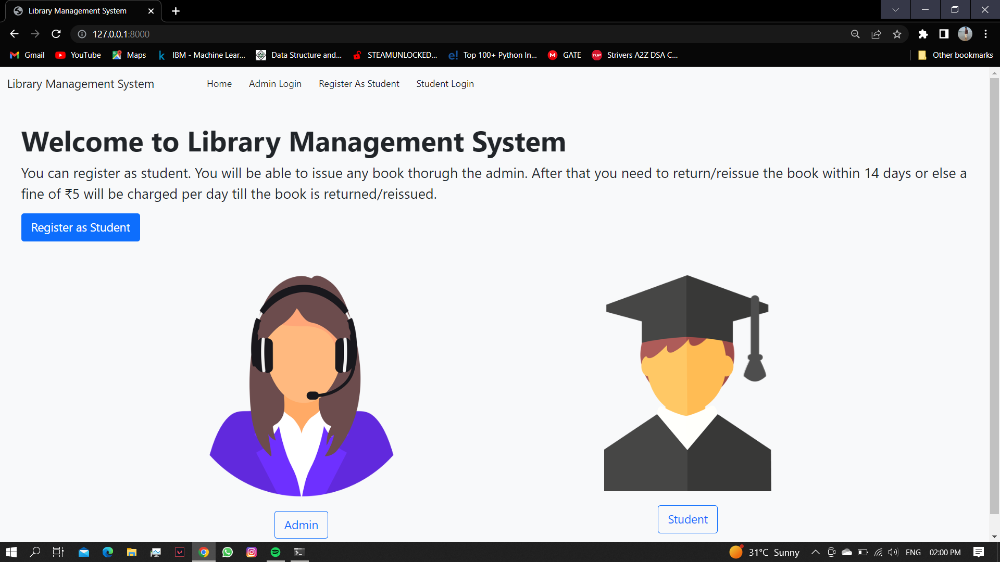
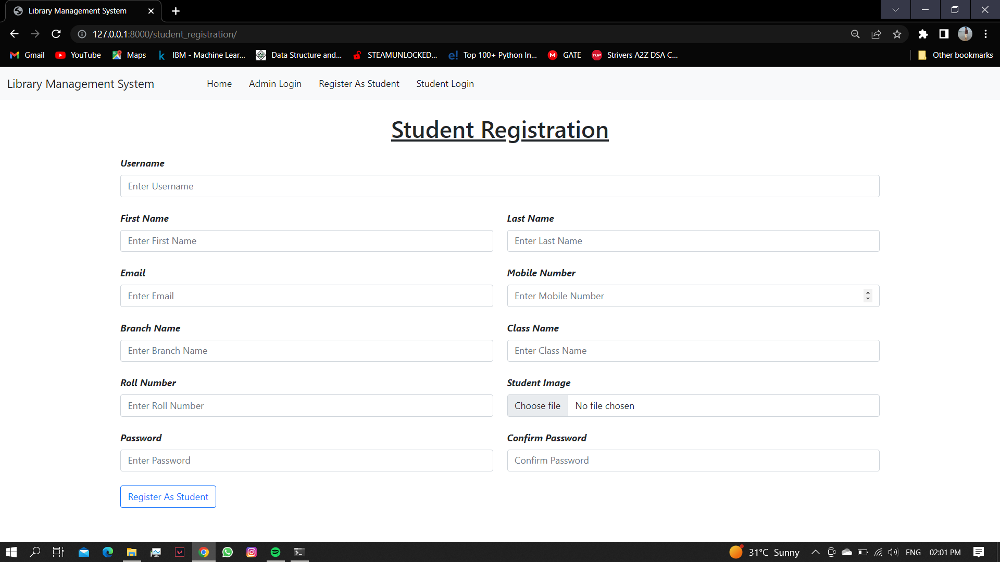
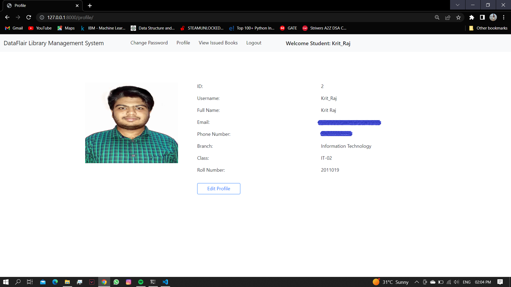
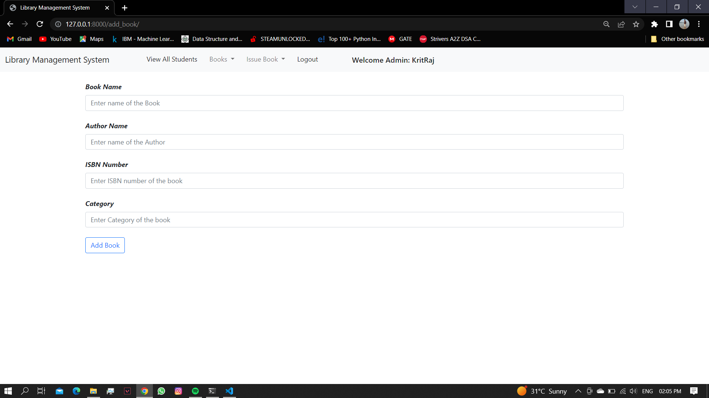

# Library-Management-System

Here new students can register themselves.

Registerd student can login can check there profile.

From here one can change his/her password, view profile and view issued books.

Admin can login and can perform following task.

* Add a new book.
* View all existing books.
* View all registerd students list.
* View all Isuued books.
* Isuue a book.

Currently i have not hosted it on any server, therfore it only works on localhost.